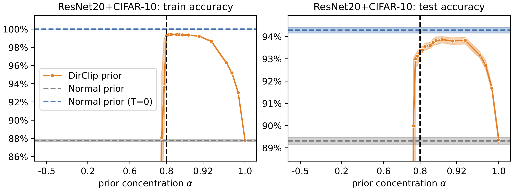

# Can a Confident Prior Replace a Cold Posterior?

Official repository for the paper *[Can a Confident Prior Replace a Cold Posterior?](https://arxiv.org/abs/2403.01272)*

[](https://arxiv.org/abs/2403.01272)

## Key ideas

**Representing aleatoric uncertainty.** We introduce the *DirClip* prior to control the aleatoric (data) uncertainty of a Bayesian neural network. Consider the following toy classification problem: should we prefer the smooth or the complex decision boundary? Either choice is valid, depending on our beliefs about the quality of the data labels. The *DirClip* prior lets us represent these beliefs.


**Results.** Using the *DirClip* prior, we can force a BNN to have low aleatoric uncertainty, nearly matching the accuracy of a cold posterior without any tempering.



**Training stability.** Why does the *DirClip* prior stop working when $\alpha<0.8$? When the prior dominates the likelihood, posterior gradients may point toward the wrong class, leading to unstable training. For a more detailed discussion, please see the [full paper](TODO_ARXIV_LINK).


## Training a model

The [core](core) directory contains all required code for model training. We recommend interfacing with Python, although Bash is also supported thanks to [Fire](https://github.com/google/python-fire).

```python
# Python
from run import run
run(model_name='cnn', ds_name='mnist', distribution='dirclip-10', distribution_param=0.9)
```

```bash
# Bash
python run.py --model_name='cnn' --ds_name='mnist' --distribution='dirclip-10' --distribution_param=0.9
```

The [experiments](experiments) directory contains three Python scripts for reproducing all of our training runs. However, they are meant to serve mostly as pseudocode: the scripts are very readable but you might find it necessary to add some experiment-management code to run multiple jobs in parallel, monitor them, etc. Since reproducing all of our experiments would take ~700 TPU-core-days, we also provide download links for [model weights](https://pub-e8bbdcbe8f6243b2a9933704a9b1d8bc.r2.dev/weights/dirclip/weights.zip) (32 GB) and [data](https://pub-e8bbdcbe8f6243b2a9933704a9b1d8bc.r2.dev/weights/dirclip/data.zip) to reproduce loss landscape plots and Normal prior confidence (31 MB).

## Notebooks

All figures in the report were generated using the provided [Jupyter notebooks](notebooks):
- [distributions.ipynb](notebooks/distributions.ipynb) provides most of the distribution visualizations (slices, gradients, training stability, etc).
- [weights_analysis_dirichlet.ipynb](notebooks/weights_analysis_dirichlet.ipynb) and [weights_analysis_cold.ipynb](notebooks/weights_analysis_cold.ipynb) provide visualizations of trained models
- [2d_classification.ipynb](notebooks/2d_classification.ipynb) uses HMC to create Figure 1

## Citation

```bibtex
@misc{marek2024confident,
  title={Can a Confident Prior Replace a Cold Posterior?}, 
  author={Martin Marek and Brooks Paige and Pavel Izmailov},
  year={2024},
  eprint={2403.01272},
  archivePrefix={arXiv},
  primaryClass={cs.LG}
}
```
